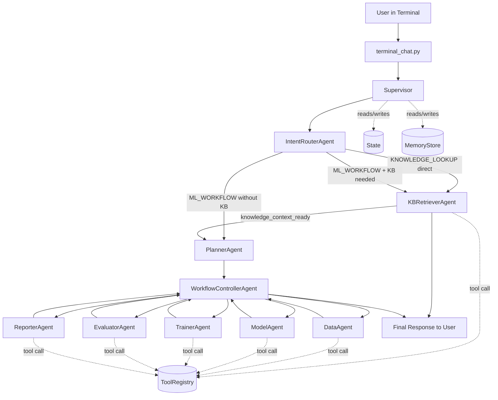
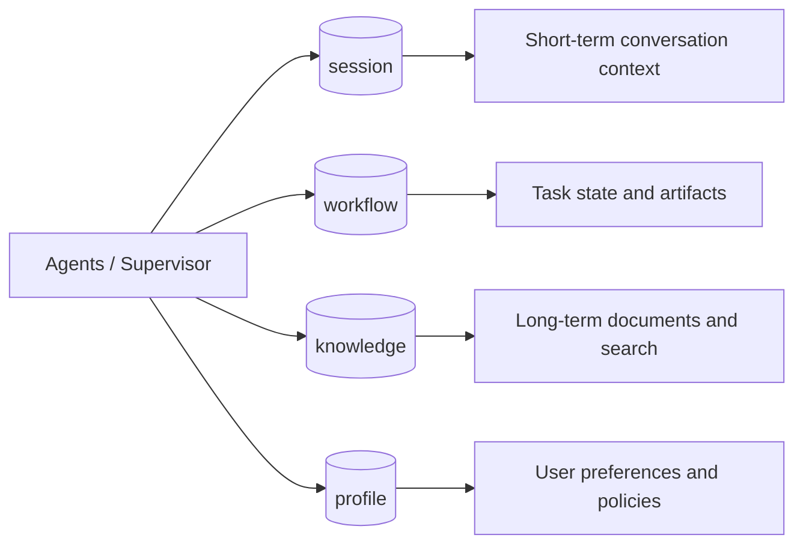
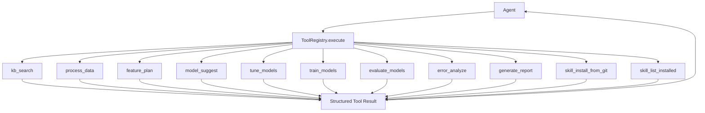
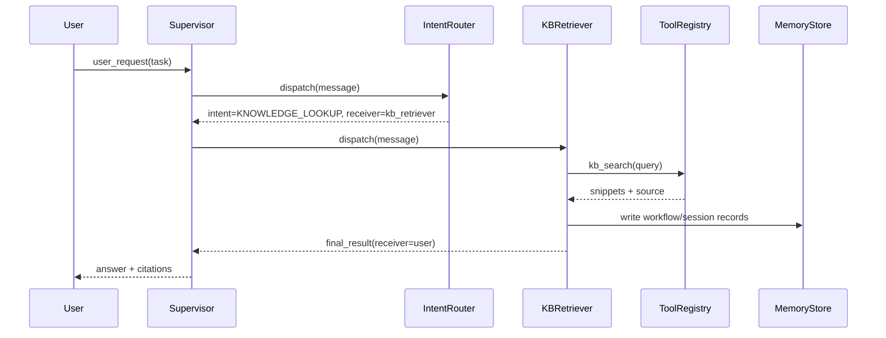
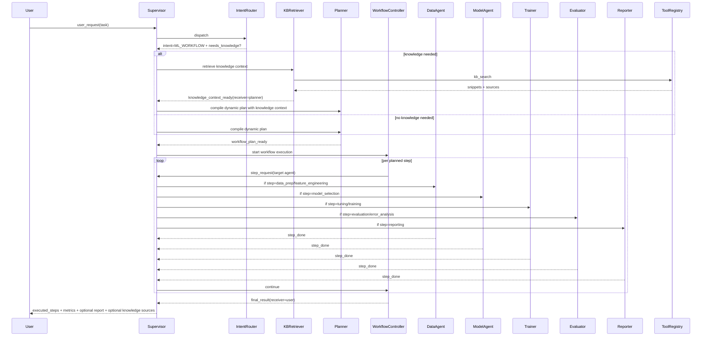

# Multi-Agent System Redesign (Knowledge + ML Workflow)

## 1. Quick Clarification on Naming

The old names were:
- `KB_QUERY`: query historical information from the knowledge base.
- `DS_PIPELINE`: run data science workflow steps end-to-end.

To make intent names easier to understand, this design uses:
- `KNOWLEDGE_LOOKUP` (instead of `KB_QUERY`)
- `ML_WORKFLOW` (instead of `DS_PIPELINE`)

Important:
- These are **primary route labels**, not isolated silos.
- `ML_WORKFLOW` can optionally call knowledge retrieval when user requirements need historical/policy/context information.

## 2. Direct Answers to Your Three Questions

### 1) Should we download the latest skills?
- Yes. Tools should support downloading and managing skills from online repositories.
- This enables a code agent to dynamically extend capabilities per task.
- In this implementation, skill operations are exposed as tools (`skill_install_from_git`, `skill_list_installed`).

### 2) Terminal chat + agent interaction + ChatGPT 4o
- Implemented in `terminal_chat.py`.
- Default model is `gpt-4o` (configurable via `--model`).
- Fallback supported: if `OPENAI_API_KEY` or SDK is unavailable, the app returns local structured output.

### 3) Redesign summary
- Core implementation is in `multi_agent_system.py`.
- Two primary intent branches are supported:
  - `KNOWLEDGE_LOOKUP`: retrieve historical knowledge snippets.
  - `ML_WORKFLOW`: dynamically decomposed workflow driven by user requirements.
  - `ML_WORKFLOW` can be knowledge-enriched before planning.

## 3. Overall Architecture

Core components:
- `Message`: one-step communication payload.
- `State`: workflow-level shared context.
- `Supervisor`: centralized routing and transition logging.
- `Agent`: isolated business unit; agents do not call each other directly.
- `PlannerAgent`: compiles a dynamic step list from user requirements.
- `WorkflowControllerAgent`: executes the dynamic step list step-by-step.
- `ToolRegistry`: unified tool registration, permission, and invocation.
- `MemoryStore`: four-layer memory management.

Main execution path:
1. User input enters `IntentRouterAgent`.
2. Router chooses a primary intent and whether knowledge enrichment is needed.
3. If enrichment is needed, route to `kb_retriever` first, then return to `planner`.
4. `planner` compiles steps based on constraints (not a fixed pipeline).
5. `workflow_controller` dispatches each step to the right capability agent.
6. `Supervisor` keeps dispatching until `receiver == user`.

### Diagram (High-Level)



## 4. Memory Design

Four namespaces:
- `session`: short-term conversation context.
- `workflow`: task-level state, artifacts, and trace records.
- `knowledge`: long-term documents and searchable snippets.
- `profile`: user preferences and policy settings (reserved).

Unified API:
- `put(namespace, key, value)`
- `get(namespace, key)`
- `search(namespace, query, top_k)`

### Diagram (Memory Layers)



## 5. Tool Design

Unified registry pattern:
- `ToolSpec(name, input_schema, output_schema, timeout_s, retry, permission, owner_agent)`
- `ToolRegistry.register(...)`
- `ToolRegistry.execute(name, **kwargs)`
- `ToolRegistry.list_tools()`

Current tool groups:
- Knowledge: `kb_search`
- Data: `process_data`, `feature_plan`
- Model: `model_suggest`, `tune_models`, `train_models`, `evaluate_models`, `error_analyze`
- Report: `generate_report`
- SkillOps: `skill_install_from_git`, `skill_list_installed`

### Diagram (Tool Invocation)



## 6. Intent Routing Strategy

Current `IntentRouterAgent` strategy:
- Use an LLM-based request understanding engine first (structured JSON output + code validation).
- Do not use keyword-based routing heuristics in the execution decision path.
- Determine a **primary intent**:
  - Knowledge-only requests -> `KNOWLEDGE_LOOKUP`.
  - Modeling/training/evaluation requests -> `ML_WORKFLOW`.
  - Casual or unclear requests -> `GENERAL_CHAT` (ask for clarification, do not trigger workflow).
- Determine whether `needs_knowledge` is true.
- If primary intent is `ML_WORKFLOW` and `needs_knowledge=true`, call `kb_retriever` first and route back to `planner`.

Fallback behavior:
- If LLM understanding is unavailable or parsing fails, do **not** auto-trigger execution.
- In fallback mode, the router asks for clarification by default.
- Fallback can still execute only when the user provides an explicit structured router command (JSON with `intent` and optional `requirements`).
- Low-confidence understanding is downgraded to `GENERAL_CHAT` to ask a focused clarification.

Current `PlannerAgent` strategy:
- Use validated requirement flags from semantic router output.
- Compile a dynamic step list.
- Send the plan to `WorkflowControllerAgent`.

Recommended evolution:
1. Keep LLM-first understanding with strict schema validation.
2. Add richer uncertainty calibration and confirmation prompts before expensive runs.
3. Add tool capability graph so router can plan around installed skills dynamically.

## 7. Business Flows (Composable)

### A. KNOWLEDGE_LOOKUP
- `intent_router -> kb_retriever -> user`
- Output: knowledge snippets + source references.



### B. ML_WORKFLOW (Dynamic)
- Main path:
  - `intent_router -> planner -> workflow_controller -> [dynamic steps] -> user`
- Knowledge-enriched path:
  - `intent_router -> kb_retriever -> planner -> workflow_controller -> [dynamic steps] -> user`
- Output: executed steps, best model, key metrics, and optional report markdown.



## 8. How to Run

1. Install dependencies:
```bash
pip install -r requirements.txt
```

2. Configure API key (optional but recommended):
```bash
export OPENAI_API_KEY="your_key"
```

3. Start terminal chat:
```bash
python terminal_chat.py --model gpt-4o --workspace .
```

4. Available commands:
- `/help`
- `/tools`
- `/skills list`
- `/skills install <repo_url> [alias] [ref]`
- `/raw on`
- `/exit`

## 9. Next Enhancements

1. Upgrade `knowledge` retrieval from keyword matching to vector search (`pgvector` or `milvus`).
2. Add strict tool input/output validation (`pydantic`).
3. Replace mock `train_models` with real executors (`sklearn`, `xgboost`, or `ray`).
4. Add HTML/PDF rendering and artifact persistence for reports.
5. Add async task queue (`Celery` or `Arq`) for long-running training jobs.
