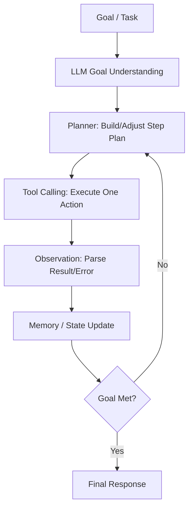

# Dynamic Multi-Agent System Redesign

## 1. Design Principles

This redesign follows one core loop, not a fixed intent pipeline:

1. Goal / Task
2. LLM understands objective
3. Planner decomposes steps
4. Tool Calling executes actions
5. Observation checks outcomes
6. Memory/State updates context
7. Continue execution or finish

Key rules:
- No rigid keyword routing.
- No fixed ML-only template.
- Plan is rebuilt from user goal, context, and tool feedback.
- Any step can call knowledge, file, or ML tools when needed.

## 2. End-to-End Loop



## 3. Runtime Components

- `DynamicLoopOrchestrator`
  - Runs the full loop: Understand -> Plan -> Tool -> Observe -> Memory -> Continue/Finish.
  - Uses `gpt-4o` (or configured model) when API key is available.
  - Includes fallback behavior when LLM is unavailable.

- `ToolRegistry`
  - Unified tool registration and execution.
  - Exposes tool catalog (name, schema, description) to planner.

- `MemoryStore`
  - `session`: multi-turn conversation history.
  - `workflow`: trace-level execution state and artifacts.
  - `knowledge`: searchable documentation/history.
  - `profile`: reserved for user preferences/policies.

- `MultiAgentSystem.run()`
  - Uses dynamic loop by default.
  - Legacy router can be enabled via `USE_LEGACY_ROUTER=1` for compatibility.

## 4. Planner Contract (Semantic, Not Keyword)

Goal understanding output (conceptual):

```json
{
  "mode": "CHAT | EXECUTE",
  "goal": "user objective in one sentence",
  "success_criteria": ["..."],
  "constraints": ["..."],
  "clarification_question": "...",
  "plan": [
    {
      "step": "what to do next",
      "tool": "registered_tool_name",
      "arguments": {}
    }
  ]
}
```

Planner/executor decision each loop:

```json
{
  "decision": "TOOL | FINAL | CLARIFY",
  "step": "current step",
  "tool_name": "...",
  "arguments": {},
  "final_answer": "...",
  "clarification_question": "..."
}
```

## 5. Tooling Strategy (Expanded)

The system now supports broader tool families so the planner can compose workflows dynamically:

### A. Workspace + Files
- `list_available_tools`
- `list_workspace_files`
- `search_workspace_text`
- `read_text_file`
- `read_json_file`
- `read_document_file` (`.pdf/.docx/.txt/.md`)
- `write_text_file`

### B. Data Understanding
- `read_csv_preview`
- `profile_csv_columns`

### C. Knowledge Memory
- `kb_search`
- `kb_add_document`

### D. ML Workflow Blocks
- `process_data`
- `feature_plan`
- `model_suggest`
- `tune_models`
- `train_models`
- `evaluate_models`
- `error_analyze`
- `generate_report`

### E. Local Skill Management (Online Extension)
- `skill_install_from_git`
- `skill_list_installed`

## 6. Why This Matches Your Requirement

Your requirement was: do not hardcode one logic path, and let workflow vary with user needs.

This redesign satisfies that by:
- Making planning tool-driven and iterative.
- Allowing ML workflow steps to call knowledge lookup at any time.
- Supporting file analysis, data profiling, report writing, and skill extension in one loop.
- Using observations to replan instead of forcing a static pipeline.

## 7. Terminal Behavior

- `/tools` now returns richer tool metadata (description + schema).
- `/file summarize <path>` still works, but internally also aligns with dynamic loop design.
- Natural language requests can trigger tool execution when goal/context is clear.

## 8. Suggested Next Upgrades

1. Add strict tool I/O validation (`pydantic`) before execution.
2. Add tool cost/latency budgeting in planner decisions.
3. Add vector retrieval for `knowledge` memory.
4. Replace simulated ML tools with real training backends.
5. Add artifact persistence layer (reports, metrics, plots).
