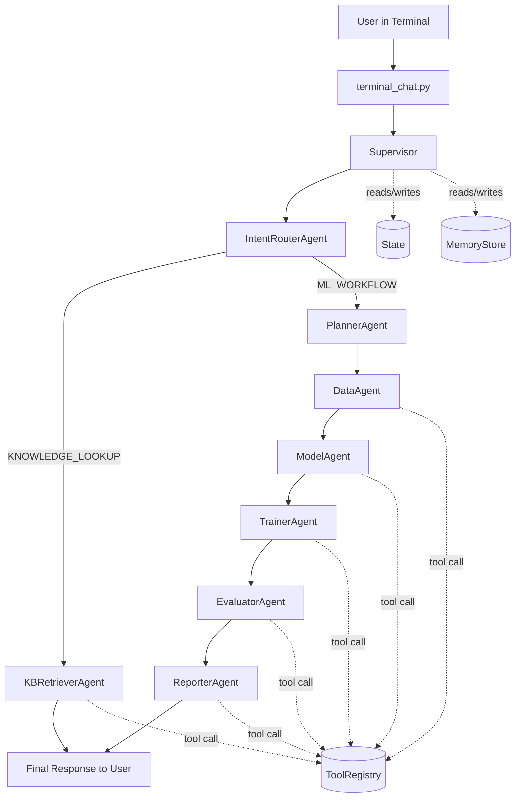
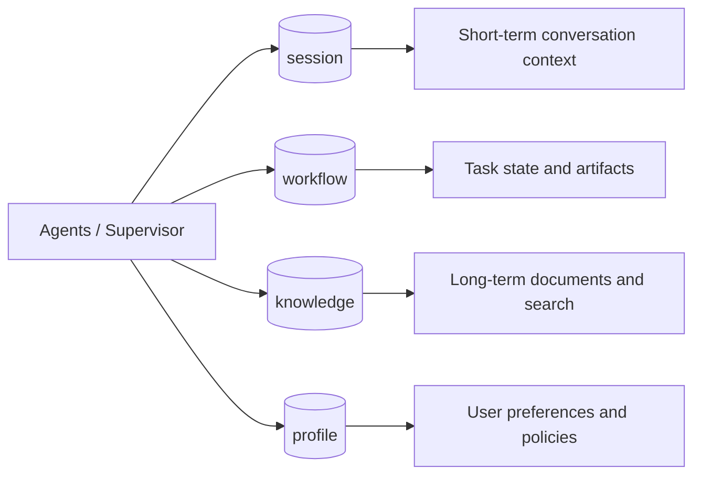
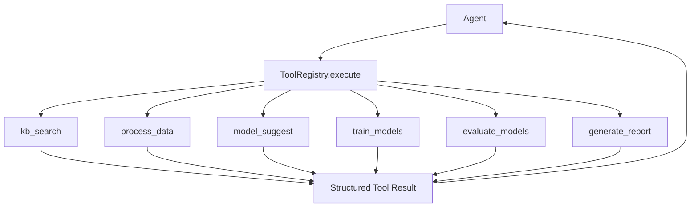
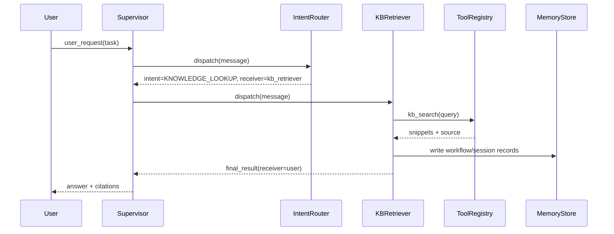
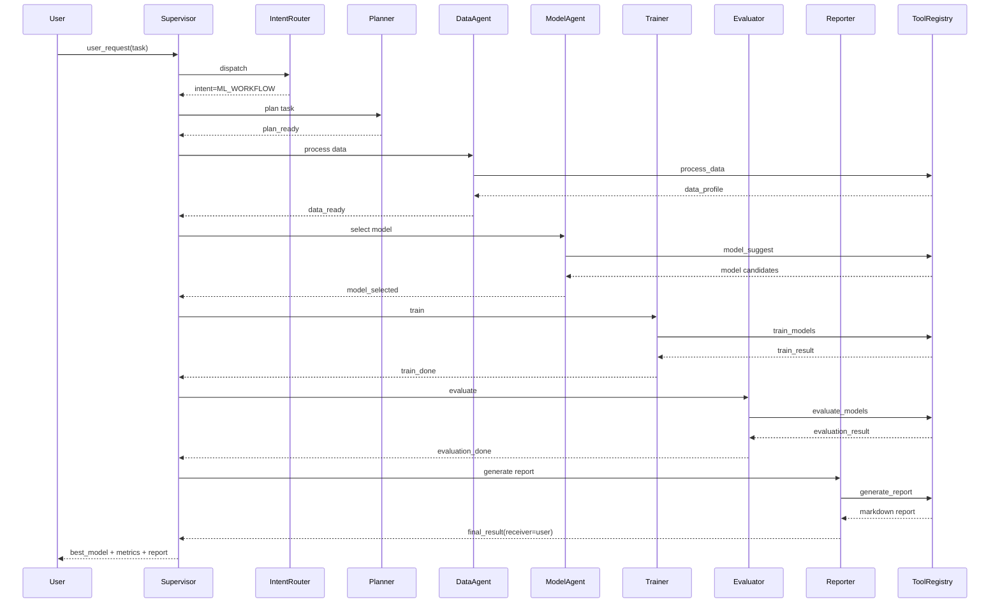

# Multi-Agent System Redesign (Knowledge + ML Workflow)

## 1. Quick Clarification on Naming

The old names were:
- `KB_QUERY`: query historical information from the knowledge base.
- `DS_PIPELINE`: run data science workflow steps end-to-end.

To make intent names easier to understand, this design uses:
- `KNOWLEDGE_LOOKUP` (instead of `KB_QUERY`)
- `ML_WORKFLOW` (instead of `DS_PIPELINE`)

## 2. Direct Answers to Your Three Questions

### 1) Should we download the latest skills?
- Yes, but it is not the first priority.
- First make the core system stable: routing, memory, tools, and supervision.
- Update skills when you add capabilities (new data sources, training backends, report formats).
- Recommended cadence: review monthly, upgrade only when needed.

### 2) Terminal chat + agent interaction + ChatGPT 4o
- Implemented in `terminal_chat.py`.
- Default model is `gpt-4o` (configurable via `--model`).
- Fallback supported: if `OPENAI_API_KEY` or SDK is unavailable, the app returns local structured output.

### 3) Redesign summary
- Core implementation is in `multi_agent_system.py`.
- Two intent branches are supported:
  - `KNOWLEDGE_LOOKUP`: retrieve historical knowledge snippets.
  - `ML_WORKFLOW`: data processing -> model selection -> training -> evaluation -> report.

## 3. Overall Architecture

Core components:
- `Message`: one-step communication payload.
- `State`: workflow-level shared context.
- `Supervisor`: centralized routing and transition logging.
- `Agent`: isolated business unit; agents do not call each other directly.
- `ToolRegistry`: unified tool registration, permission, and invocation.
- `MemoryStore`: four-layer memory management.

Main execution path:
1. User input enters `IntentRouterAgent`.
2. Router chooses `kb_retriever` or `planner`.
3. `Supervisor` keeps dispatching until `receiver == user`.

### Diagram (High-Level)



## 4. Memory Design

Four namespaces:
- `session`: short-term conversation context.
- `workflow`: task-level state, artifacts, and trace records.
- `knowledge`: long-term documents and searchable snippets.
- `profile`: user preferences and policy settings (reserved).

Unified API:
- `put(namespace, key, value)`
- `get(namespace, key)`
- `search(namespace, query, top_k)`

### Diagram (Memory Layers)



## 5. Tool Design

Unified registry pattern:
- `ToolSpec(name, input_schema, output_schema, timeout_s, retry, permission, owner_agent)`
- `ToolRegistry.register(...)`
- `ToolRegistry.execute(name, **kwargs)`
- `ToolRegistry.list_tools()`

Current tool groups:
- Knowledge: `kb_search`
- Data: `process_data`
- Model: `model_suggest`, `train_models`, `evaluate_models`
- Report: `generate_report`

### Diagram (Tool Invocation)



## 6. Intent Routing Strategy

Current `IntentRouterAgent` strategy:
- If query matches knowledge-history terms -> `KNOWLEDGE_LOOKUP`.
- Otherwise default -> `ML_WORKFLOW`.

Recommended evolution:
1. Rule-based first (fast and deterministic).
2. LLM fallback for ambiguous requests.
3. Code-level validation to enforce whitelist intents.

## 7. Two Business Flows

### A. KNOWLEDGE_LOOKUP
- `intent_router -> kb_retriever -> user`
- Output: knowledge snippets + source references.



### B. ML_WORKFLOW
- `intent_router -> planner -> data_agent -> model_agent -> trainer -> evaluator -> reporter -> user`
- Output: best model, key metrics, and report markdown.



## 8. How to Run

1. Install dependencies:
```bash
pip install -r requirements.txt
```

2. Configure API key (optional but recommended):
```bash
export OPENAI_API_KEY="your_key"
```

3. Start terminal chat:
```bash
python terminal_chat.py --model gpt-4o --workspace .
```

4. Available commands:
- `/help`
- `/tools`
- `/raw on`
- `/exit`

## 9. Next Enhancements

1. Upgrade `knowledge` retrieval from keyword matching to vector search (`pgvector` or `milvus`).
2. Add strict tool input/output validation (`pydantic`).
3. Replace mock `train_models` with real executors (`sklearn`, `xgboost`, or `ray`).
4. Add HTML/PDF rendering and artifact persistence for reports.
5. Add async task queue (`Celery` or `Arq`) for long-running training jobs.

